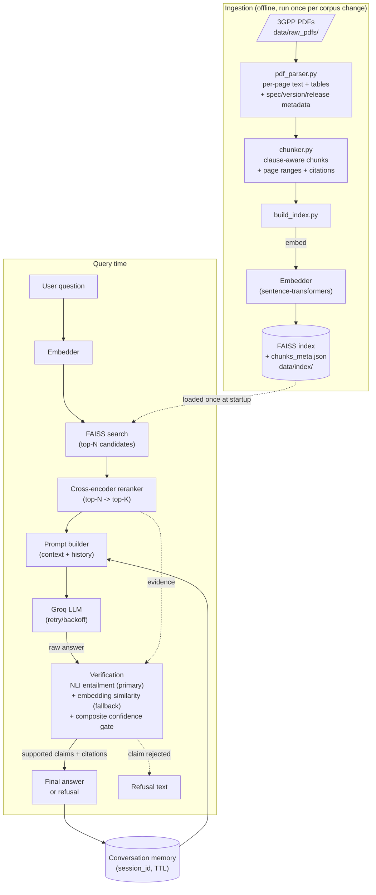
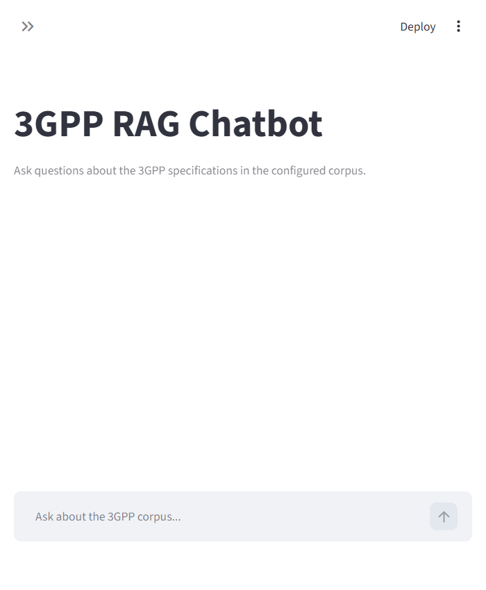

# 3GPP RAG Chatbot

Retrieval-augmented Q&A over 3GPP technical specifications. Every answer is
checked against retrieved spec text before it's shown to the user; if the
evidence isn't strong enough, the bot says so instead of guessing.

This is a rebuild of an earlier prototype. See [`FIXES.md`](FIXES.md) for a
point-by-point mapping from the original review findings to what changed.

## Architecture



**Retrieval → rerank → generate → verify.** The LLM never gets the final
word: every sentence it produces is split into claims, each claim is
checked against the retrieved evidence with an entailment model, and only
claims that clear both a semantic-entailment gate *and* a composite
confidence score survive into the final answer. If nothing survives, the
bot refuses. See [Hallucination control](#hallucination-control) below.

## Project layout

```
app/
  config.py            All settings (env-driven, nothing hardcoded)
  logging_config.py    Structured logging setup
  pipeline.py           RagPipeline — orchestrates retrieve→rerank→generate→verify
  cli.py, ../main.py    CLI entry points (share the same pipeline as the API)
  ingestion/
    pdf_parser.py       Real PDF parsing: pages, headings, tables, spec metadata
    chunker.py          Clause-aware chunking with full citation metadata
    build_index.py       Standalone ingestion CLI
  retrieval/
    embedder.py          Bi-encoder wrapper (lazy-loaded singleton)
    vector_store.py      FAISS persistence — loads existing index, doesn't rebuild blindly
    reranker.py           Cross-encoder reranking stage
  generation/
    llm_client.py         Groq client with retry/backoff and typed errors
    prompts.py             Prompt templates
  verification/
    claims.py               Splits an answer into individual claims
    nli_verifier.py          NLI entailment model (primary hallucination check)
    embedding_verifier.py    Embedding-similarity fallback
    confidence.py            Combines signals into an accept/refuse decision
  memory/
    conversation.py       In-memory session store with TTL + trimming
  api/
    main.py, routes.py, schemas.py   FastAPI backend
web/
  index.html             Chat UI (served as static files by the API)
data/
  raw_pdfs/              Drop your 3GPP PDFs here (sample_corpus/ ships a synthetic demo set)
  processed/, index/     Generated — not checked into version control
eval/
  eval_dataset.json      QA pairs (in-scope + adversarial) for evaluation
  run_eval.py             Retrieval + hallucination-rate evaluation harness
tests/                   Unit + integration tests (44 tests, no network required)
scripts/
  generate_sample_corpus.py   Generates the synthetic demo PDF corpus
```

## Quickstart

```bash
python -m venv .venv && source .venv/bin/activate
pip install -r requirements-dev.txt      # -dev adds pytest/reportlab; use requirements.txt for prod-only

cp .env.example .env
# edit .env: set GROQ_API_KEY (get one at https://console.groq.com/keys)

# You need some PDFs in data/raw_pdfs/ before the index can be built.
# Option A — try it with the bundled synthetic demo corpus (5 sample specs):
python scripts/generate_sample_corpus.py

# Option B — use real specs: download PDFs from
# https://www.3gpp.org/specifications-technologies (free, no login) and
# drop them anywhere under data/raw_pdfs/. No code changes needed —
# the same parser handles both.

# Run the API + web UI:
uvicorn app.api.main:app --reload
# then open http://localhost:8000

# ...or the CLI:
python -m app.cli

# ...or Streamlit:
streamlit run streamlit_app.py
```

### Deploy on Streamlit Community Cloud

1. Push this repository to GitHub.
2. Create an app at [share.streamlit.io](https://share.streamlit.io/), select
  the repository, and set the main file to `streamlit_app.py`.
3. Add these values in the app's **Settings > Secrets**:
  `GROQ_API_KEY = "your-key"` and `GROQ_MODEL = "openai/gpt-oss-20b"`.
  If `GROQ_MODEL` is already set to `llama-3.3-70b-versatile`, replace it or
  remove it because that model is not available to every Groq account.
4. Include the PDFs you are allowed to deploy under `data/raw_pdfs/`, or
  commit a generated FAISS index and metadata under `data/index/` and
  `data/processed/`. The first startup downloads the embedding, reranker,
  and NLI models and may take several minutes.

The Streamlit app caches the pipeline for the lifetime of the worker and
keeps conversation history in the browser session. Streamlit Cloud workers
are ephemeral, so use a persistent database instead of the in-memory
conversation store if conversation history must survive restarts or scale
across multiple workers.

### Streamlit Interface



The screenshot shows the verified local Streamlit interface before an API
question is submitted. A configured Groq secret and an indexed corpus are
required to run a complete question-and-answer flow.

The first run downloads the embedding, reranker, and NLI models from
Hugging Face (a few hundred MB total) and builds the FAISS index — this
can take a minute or two. Every subsequent start loads the persisted
index straight from disk instead of rebuilding it (see
[`FIXES.md` #2](FIXES.md)).

### LLM Provider Selection

This prototype uses Groq as its language-model provider because Groq offers
free access suitable for development, demonstration, and initial evaluation.
The provider, endpoint, model, timeout, and retry settings are environment-
driven through `app/config.py`, so the implementation can be adapted to a
different provider or a paid production deployment without changing the
retrieval and verification pipeline.

> **About the sample corpus.** `scripts/generate_sample_corpus.py`
> generates five original PDFs (TS 38.331, 23.501, 24.501, 38.321, 33.501)
> that mimic the *structure* of real 3GPP specs — running headers with
> spec/version, numbered clauses, tables — but the text is written for
> this project, not copied from any real 3GPP document. This lets the
> whole pipeline (multi-document PDF ingestion, citations, retrieval,
> eval) be exercised without redistributing copyrighted standards text.
> The ingestion code itself is generic and works identically on real
> 3GPP PDFs — just point `data/raw_pdfs/` at them.

## Hallucination control

This directly targets the two sharpest original findings: *"hallucination
detection is weak — SequenceMatcher is not reliable"* and *"no proper
confidence/evidence threshold to decide when to refuse."*

**1. Retrieval floor, before generation.** If nothing retrieved clears
`MIN_RETRIEVAL_SCORE`, the bot refuses without even calling the LLM —
cheaper, faster, and it doesn't tempt the model to improvise around thin
context.

**2. Claim-level verification, not answer-level.** The LLM's raw answer is
split into individual sentences ("claims"). Each claim is checked
independently — a three-sentence answer can end up with two sentences
kept and one dropped, rather than being accepted or refused as a whole.

**3. Entailment, not string similarity.** Each claim is checked against
the retrieved passages with a cross-encoder **NLI (Natural Language
Inference)** model, which asks "does this passage *entail* this claim?"
— falling back to embedding cosine similarity only if the NLI model is
unavailable. This is the direct fix for the `difflib.SequenceMatcher`
problem: SequenceMatcher scores by character overlap, so
`"EIRP shall not exceed 20 dBm"` and `"EIRP shall not exceed 99 dBm"`
look almost identical to it — it would happily accept a fabricated
number. An entailment model (and, as a fallback, semantic embedding
similarity) doesn't have this blind spot.

**4. Semantic entailment is a hard gate, not just one weighted factor.**
An early version of this scoring blended retrieval score + rerank score +
entailment score into a single weighted average — which turned out to let
a *very* topically relevant passage (high retrieval/rerank scores) mask a
claim that wasn't actually entailed by it. `MIN_SEMANTIC_SCORE` fixes
this: a claim must independently clear the entailment bar *and* the
composite confidence bar. This is asserted directly in
[`tests/test_confidence.py::test_numeric_mismatch_is_caught_even_with_high_word_overlap`](tests/test_confidence.py).

**5. A configurable refusal threshold.** `MIN_CONFIDENCE_SCORE` and
`MIN_SEMANTIC_SCORE` (in `.env`) control how strict the gate is. Claims
that don't clear it are dropped from the final answer; if *no* claim
survives, the bot returns a single, consistent refusal message instead of
a partial or fabricated answer.

## Hallucination control — verified behavior

Run `pytest tests/test_confidence.py -v` to see (offline, no network
needed) that the verifier:
- accepts a claim that's genuinely entailed by retrieved evidence, with a citation;
- refuses when the retrieved evidence has nothing to do with the claim;
- **refuses a claim that shares almost all its wording with a passage but changes a number** — the case naive string similarity gets wrong;
- passes an LLM's own self-refusal straight through unchanged;
- keeps only the supported half of a partially-correct, partially-fabricated answer.

## Configuration reference

All settings live in `.env` (copy from `.env.example`); see that file for
the full list with inline comments. The ones most worth tuning:

| Variable | Default | What it controls |
|---|---|---|
| `RETRIEVAL_TOP_N` | 20 | Candidates pulled from FAISS before reranking |
| `RETRIEVAL_TOP_K` | 4 | Passages kept after reranking, sent to the LLM |
| `MIN_RETRIEVAL_SCORE` | 0.30 | Floor similarity to consider a chunk on-topic at all |
| `MIN_SEMANTIC_SCORE` | 0.50 | Hard entailment gate per claim |
| `MIN_CONFIDENCE_SCORE` | 0.55 | Composite score gate per claim |
| `ENABLE_RERANKER` / `ENABLE_NLI_VERIFIER` | true | Disable to fall back to FAISS ordering / embedding similarity only |
| `MAX_HISTORY_TURNS` | 6 | Conversation turns kept per session |
| `GROQ_MODEL` | `openai/gpt-oss-20b` | Any Groq-hosted chat model available to your account |

## Evaluation

```bash
python -m eval.run_eval                  # full run (needs GROQ_API_KEY + real models)
python -m eval.run_eval --skip-generation  # retrieval metrics only, no LLM calls
python -m eval.run_eval --offline          # harness self-test, no network at all
```

`eval/eval_dataset.json` has 18 in-scope questions (each with an expected
spec/clause and gold keywords) and 6 out-of-scope/adversarial questions
(plausible-sounding but unanswerable from the corpus). The harness
reports:

- **Recall@k / MRR** — did retrieval find the right clause at all, and how highly did it rank?
- **Keyword coverage** — for in-scope questions, does the final (post-verification) answer contain the expected facts?
- **Answerable-question refusal rate** — how often the bot wrongly refuses something it should be able to answer (want this low).
- **Hallucination rate** — the fraction of out-of-scope/adversarial questions the bot answers instead of refusing (want this at or near 0%).

Results are written to `eval/results/report.json` and `report.md`.

### Offline Baseline Results

The deterministic offline harness was run against the bundled five-document
sample corpus on 21 September 2026:

| Metric | Result |
|---|---:|
| Questions evaluated | 18 in-scope questions |
| Recall@5 | 83.3% |
| Mean Reciprocal Rank | 0.645 |
| End-to-end generation metrics | Not measured in offline mode |

These are retrieval-harness baseline results using the deterministic fake
embedder. They are reproducible and useful for regression checks, but they
do not represent live embedding, reranking, NLI, or Groq generation quality.
Run the live evaluation with a configured `GROQ_API_KEY` and downloaded
models before making production-quality claims.

> `--offline` mode swaps in a deterministic bag-of-words fake embedder so
> the harness can be smoke-tested with no network access at all — useful
> in CI or a sandboxed environment, but its retrieval numbers are **not**
> representative of real quality. Real evaluation needs the actual
> sentence-transformers models and a Groq key.

## Testing

```bash
pytest                    # 44 tests, fully offline (deterministic fakes for the ML models)
pytest tests/ -v           # verbose
pytest tests/test_confidence.py -v   # just the hallucination-gating logic
```

`tests/fakes.py` provides a deterministic embedder and NLI verifier so the
*logic* (chunking, ranking, confidence blending, refusal thresholds, the
FastAPI contract) is fully tested without downloading any model or
touching the network. `tests/test_integration_ingestion.py` runs the full
ingestion pipeline against the real bundled sample-corpus PDFs.

## API

Interactive docs at `http://localhost:8000/docs` once the server is
running. Summary:

| Endpoint | Method | Purpose |
|---|---|---|
| `/api/chat` | POST | `{question, session_id?}` → answer, citations, confidence, refusal flag |
| `/api/health` | GET | Index size, which optional models are enabled, whether Groq is configured |
| `/api/sessions/new` | POST | Explicitly create a session (optional — `/chat` auto-creates one) |
| `/api/sessions/{id}/reset` | POST | Clear a session's conversation memory |

## Known limitations

- The bundled sample corpus is synthetic (see above) — swap in real 3GPP PDFs for real use.
- Conversation memory is in-process and non-persistent; restart the server and sessions are gone. Fine for a single instance; swap `app/memory/conversation.py`'s backing store for Redis/Postgres to scale out.
- Heading detection in `pdf_parser.py` relies on font-size/boldness heuristics plus a numbered-clause regex; scanned (image-only) PDFs need OCR first — this pipeline expects a text layer.
- The NLI and reranker models add latency and require the first run to have internet access to Hugging Face; set `ENABLE_RERANKER=false` / `ENABLE_NLI_VERIFIER=false` to run FAISS-only if needed (verification then falls back to embedding similarity).
